# 프로젝트명: 1년(1Year)-수정중-

# [ 목차 ]
## 1. [게임명](#0)
## 2. [컨셉](#1)
## 3. [관련 이미지 & 동영상](#2)
## 4. [대표이미지](#3)
## 5. [컨셉 & 대표이미지 기반 작품묘사](#4)
## 6. [1년(1ear)의 구성](#5)
## 7. [게임 시스템 디자인](#6)
#### a. [게임 오브젝트 분해](#6-a)
#### b. [파라미터(속성)](#6-b)
#### c. [행동](#6-c)
#### d. [상태](#6-d)
#### e. [플레이어 캐릭터 속성(파라미터)](#6-e)
#### f. [게임의 규칙](#6-f)
## 8. [개발 요구사항 & 흐름도](#7)
#### a. [요구사항(Part.)](#7-a)
#### b. [시간별 흐름도 Flowchart](#7-b)
#### c. [키보드 이벤트에 대한 흐름도](#7-c)
#### d. [용어정리](#7-d)
## 9. [스토리보드](#8)
## 10. [개발작업 일정(Part.)](#9)
#### a. [Part.1](#9-a)
#### b. [Part.2](#9-b)
#### c. [Part.3](#9-c)
#### d. [Part.4](#9-d)

# [게임명] 

## 1년 (1 Year)

# [컨셉] 

## 메인컨셉 : 협동

- 2인 플레이로 제작하여 서로간의 협동을 중심으로 게임을 진행

### 서브 컨셉 1 : 미로

- 협동을 하여 탈출하는 공간을 미로로 설정
- 넓은 맵을 이용하기 보다는 미로의 컨셉을 넣어 협동의 컨셉을 살리고자 함

### 서브 컨샙 2 : 시야

- 두 명의 플레이어에 각각 카메라를 달아 서로의 시야를 다르게 설정하지만 한 화면에 배치
- 각각 다른 화면을 한 화면에 배치함으로 영감을 받은 It Takes Two 와 같은 협동을 이끌어올 수 있다고 생각

### 서브 컨셉 3 : 함정

- 미로 곳곳에 탈출을 방해하는 함정을 설치함으로 탈출을 방해한다.
- 탈출을 늦추거나 미로의 시작지점으로 되돌아가게 설정
- 서브 컨셉 4와는 다르게 적용

### 서브 컨셉 4 : 히든

- 숨겨져 있거나 미로의 벽에 교묘하게 장착되있는 장치를 작동시켜야만 길이 열리는 컨셉으로 제작
- 장치는 단순한 발판으로 될 수있고 다른 장치가 될 수도 있다.

### 서브 컨셉 5 : 챕터

- 한 개의 미로가 아니라 여러개의 미로를 구현하여 어느정도의 시간이 걸리게 설정
- 제목의 의미를 담아 최소 4개의 챕터로 사계절을 나타낼 예정

  

# [관련 이미지 & 동영상] 

- 이미지  
  
- 동영상
  
  [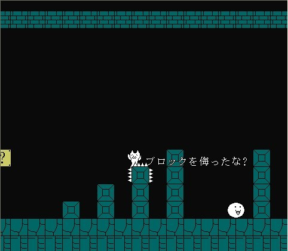](https://youtu.be/JYZQKSgkZrk)

  

# [대표 이미지] 

[그림]

  

# [컨셉 & 대표이미지 기반 작품묘사] 

> ### 대표이미지 기반 : 

> ### 컨셉 기반:
> 협동 : 2인플레이로 서로간의 협동을 중심으로 하는 게임
> 미로 : 협동의 컨셉에 미로를 첨가해서 협동의 역할을 돋보이게 하고자함
> 시야 : 2명의 플레이어 화면을 한 모니터에 같이 넣음으로서 협동컨셉을 올리고자함
> 함정 : 미로 탈출을 방해하는 함정을 설치하여 탈출을 늦춘다.
> 히든 : 함정을 해결하는 장치를 교묘하게 숨겨놓았다.
> 챕터 : 한개의 미로보단 챕터를 나눠 진행한다.

  

# [<1년(1Year)> 구성 요소] 

- 당신의 동료와 함께 힘을 모아 탈출 하는 3D미로 게임

 

## 1. 메커니즘

[도전 과제]

1. 미로 통과와 동시에 숨겨진 열쇠를 찾아 동료의 길을 열어라
2. 미로 곳곳에 있는 함정을 피해 자신과 동료의 리셋을 막아라
3. 여러개의 미로를 통과하여 동료와 함께 탈출하라

[재미 요소]

1. 숨겨진 열쇠를 찾으면 같은 팀의 길이 열린다.
2. 자기가 먼저 나아갈려해도 앞길은 낭떨어지 뿐이라 동료의 도움을 빌어야 될 수있다.
3. 열쇠는 2개가 동시에 있을 수 있다.
4. 마지막 챕터의 만남에서 또한 트릭이 숨어있다.

 

## 2. 이야기

[만들게 된 배경]  
  최근 유튜브에서 it takes two라는 게임을 재미있게 시청한 기억이 있다. 그래서 나도 이런 게임을 한번 만들어 보자라는 생각을 가지게 되었고 어떻게 하면 나만의 it takes two를 만들 수 있을까 고민하였고 예전부터 만들어 보고싶었던 미로라는 장르를 합쳐서 지금의 게임을 생각해보았다.

[카메라 관점]  
  카메라는 각 플레이어들의 1인칭 시점으로 제공되며 시점 버그로 미로를 미리 보게하는것을 방지하고자 한다. 그리고 각 플레이어들의 시점이 한 화면에 제공하여 자신의 화면을 보는 동시에 다른 플레이어의 화면을 볼 수있게 한다.
  
[스토리]
  어느 날 친구와 함께 담력 테스트를 하러 소문이 자자한 어느 한 건물에 들어가게 된다. 거기서 당신들이 마주한 것은 그저 평범한 물건들과 평범한 폐건물 내부였다. 하지만 소문에 비하면 평범하기 그지없었다. 그리고 당신은 친구와 함께 "별거 없잖아..."를 외치며 나가려고 했다. 하지만 그 동시에 건물 내부에는 엄청난 빛이 나와 시야를 가리게 되고 눈을 떠보니 눈앞에는 미로만이 존재하였다. 혼자 떨어진 줄 알았지만 친구의 목소리가 들려오게 되고 둘은 같은공간 다른 미로에 떨어지게 된 것을 알게 되고 다른 방법이 없는 것을 알게 된 친구와 당신은 미로를 탈출하기로 한다. 그러자 앞에 보이는 문구 하나 "가끔은 인생을 돌아보는 것도 중요하지. 그게 지금 바로 옆에 있는 사람이라는 더욱더 중요하겠지 그런 시간을 가져본 적이 있나...?"라는 글만이 있었다. 그 이후 미로를 헤쳐나가면서 무언가를 느끼게 되는데...

 

## 3. 미적요소

[디자인]
- 미로는 3D로 제작예정이며 미로는 직접 플레이어 디자인은 평벙한 사람디자인이 아닌 카툰스타일로 디자인할 예정이다. 

[컬러]
- 컬러는 챕터별로 봄, 여름, 가을, 겨울에 맞는 색상으로 바뀌며 진행된다.
- 미로의 색상이 바뀜에따라 숨겨진 열쇠와 참정 또한 컨셉에 맞게 변경되는 점도 게임을 즐기는대 도움을 줄것을 예상

[음향]  
- 계절이 지남에 따라 봄은 들뜨는 느낌, 여름은 조금 신나는 느낌, 가을은 잔잔하고 겨움은 마지막에 두 플레이어가 만나는 곳이므로 조금 들뜨는 느낌으로 음향을 조절할 예정

 

## 4. 기술
- Unity 3D
- Server · Network

# [게임 시스템 디자인] 

## 1. 게임 오브젝트 분해 (구성 요소 분석) 

|연번|오브젝트 이름|오브젝트 이미지|
|:----:|:----:|:----:|
|1|플레이어|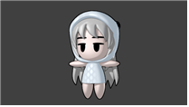|
|2|미로|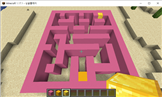|
|3|열쇠|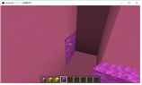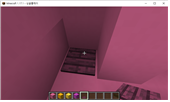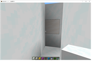|
|4|함정|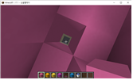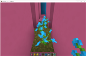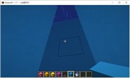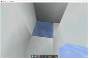|

## 2. 파라미터(속성) 뽑아 보기 

### 1) 오브젝트 이름 : 플레이어

|속성|영문명칭|설명|비고|
|:----:|:----:|:----:|:----:|
|이름|name|플레이어1, 2를 나누기 위한 각자의 이름|-|
|이동속도|speed|플레이어들의 이동속도. 속도는 앞 뒤 옆 이동 시 모두 동일하다.|-|

### 2) 오브젝트 이름 : 미로

|속성|영문명칭|설명|비고|
|:----:|:----:|:----:|:----:|
|종류|maze_Type|미로는 봄,여름,가을,겨울 계절별로 존재하며 스테이지를 나누는 종류의 개념으로 사용된다.|-|

### 3) 오브젝트 이름 : 열쇠

|속성|영문명칭|설명|비고|
|:----:|:----:|:----:|:----:|
|고유번호|key_0 ~ 30|함정과 맞는 열쇠인지 체크를 하게된다.|-|
|상태1|is_Lock|열쇠가 사용하기 전인지 알려주는 값|-|
|상태2|is_Open|열쇠를 사용한 후인지 알려주는 값|-|

### 4) 오브젝트 이름 : 함정

|속성|영문명칭|설명|비고|
|:----:|:----:|:----:|:----:|
|고유번호|trap_0 ~ 30|열쇠와 맞는 함정인지 체크를 하게 된다.|-|
|상태1|is_Lock|함정이 발동되기 전인지 알려주는 값|-|
|상태2|is_Open|함정이 발동된 후인지 알려주는 값|-|

## 3. 행동 뽑아 보기 

### 1) 오브젝트 이름 : 플레이어

|행동|설명|
|:----:|:----:|
|대기|아무 행동도 하지 않는다.|
|순간이동|미로의 마무리인 포탈을 사용한다.|

### 2) 오브젝트 이름 : 미로

|행동|설명|
|:----:|:----:|
|길 생김|낭떨어지였던 곳이 열쇠에 의해 길이 생긴다.|
|포탈 생성|미로의 마지막 포탈이 생성된다.|

### 3) 오브젝트 이름 : 함정

|행동|설명|
|:----:|:----:|
|함정 발동|플레이어가 특정 미로의 블록 이벤트로 생기는 함정에 걸렸을 때 발생.|
|함정 종료|플레이어가 특정 미로의 블록 이벤트로 생기는 함정에서 나왔을 때.|

## 4. 상태 뽑아 보기 

### 1) 오브젝트 이름 : 플레이어

|현상태|전이상태|전이조건|
|:----:|:----:|:----:|
|정상|넝쿨(기본 이동속도-50%)|플레이어가 봄미로 일 때 꽃밭에 있는 동안 지속|
|정상|감기|플레이어가 꽃가루 지역에 들어간다.|
|정상|목마름|플레이어가 가뭄 지역에 들어가서 있는 동안 지속|
|정상|몸살|플레이어가 가을 미로에 있을 경우 지속적으로 받는다.|
|현재 미로|다음 미로|플레이어가 포탈로 들어간다.|

### 2) 오브젝트 이름 : 함정

|현상태|전이상태|전이조건|
|:----:|:----:|:----:|
|낭떨어지 블록/false|낭떨어지 블록/true|플레이어가 열쇠로 해결 했을 시|
|함정 발동|함정 종료|함정의 지속시간이 다 되었을 시|
|함정 종료|함정 재생성|플레이어가 함정에 의해 초기화를 당했을 시|

## 5. 플레이어 캐릭터 속성(파라미터) 

|속성|영문명칭|설명|비고|
|:----:|:----:|:----:|:----:|
|이동속도|speed|플레이어의 이동속도를 나타낸다.|-|
|상호작용키|GetMouseButtonDown(0)|열쇠를 작동할 수 있는 키다.|-|
|위치정보|Tranform|플레이어의 위치정보|-|
|함정|is_Trap|플레이어가 함정에 걸렸는지 검사하는 속성|-|

## 6. 게임의 규칙 

### 1) 핵심 규칙
1. 함정을 피하거나 견뎌 미로를 탈출하라
2. 같이 플레이하는 사람의 함정은 자신이 해결할 수 있다.
3. 진행을 동시에 하는 것이 미로 해결에 핵심

### 2) 보조 규칙
1. 함정은 언제나 같은 자리에 존재한다.
2. 위치 초기화 함정이 있는 곳은 언제나 의심해야 한다.
3. 막다른 길을 싫어하지 말아야 할 것

# [개발 요구사항 & 흐름도] 

## 1. 요구사항 

### 1) 요구사항 Part.1
- 미로는 정사각형 기준 20x20을 기준으로 잡고 제작을 한다.
- 미로와 플레이어는 충돌판정에 의해 통과할 수 없다.
- 조작은 기본적으로 W(전)S(좌)A(후)D(우)로 이동을 하며 마우스로 화면을 움직일 수 있다.
- WSAD의 속도는 모두 같다.
- 플레이어 인칭은 1인칭으로 화면에 비춘다.
- 스테이지마다 인칭의 변화는 없으며 미로의 종류변화만 있다.
- 낭떨어지의 개수는 스테이지당 10개 미만으로 설정
- 낭떨어지(함정)의 개수와 열쇠의 개수는 동일하게 한다.
- 함정(낭떨어지)의 열쇠 힌트는 바닥색상으로 준다.
- 게임화면에는 플레이어1과 플레이어2의 화면이 중간 세로줄을 기준으로 좌측은 플레이어1, 우측은 플레이어2의 화면이 나온다.

### 2) 요구사항 Part.2
- 상호작용은 단 1번만 작용되며 한번 작용된 열쇠는 다시 작용하지 않는다.
- 함정 및 포탈은 플레이어 중심점을 기준으로 발동이 된다.
- 지속함정이 아닌 발동함정은 한 번 발동되면 사라진다.
- 남은 함정, 열쇠, 발판의 개수는 알려주지 않는다.
- 시작화면, 게임화면, 게임클리어화면, 설정화면, 설명화면 총 5개의 화면이 있다.
- 시작화면에는 시작, 설정, 게임설명, 게임종료 라는 버튼 4개가 있다.
- 설명화면에는 메인으로 버튼이 있고 클릭 시 시작화면으로 이동한다.
- 게임종료 조건은 따로 없으며 ESC를 누를 시 나가기 버튼이 화면 중간에 나오게 된다.

### 3) 요구사항 Part.3
- 시작버튼 클릭 시 기존 4개의 버튼은 사라지고 플레이어1인지 플레이어2인지 선택 할 수 있는 버튼이 있다.
- 설명보기 버튼을 클릭 시 설명화면으로 이동한다.
- 게임시작버튼 클릭 이후 플레이어1 또는 플레이어2 클릭시 각자의 게임화면으로 넘어간다.
- 설정버튼 클릭 시 음량을 설정할 수 있다.
- 나가기 버튼을 누를 시 메인화면으로 빠져나가게 된다.
- 나가기 버튼으로 게임을 나오고 다시 시작버튼으로 게임 시작을 하게되면 처음부터 진행한다.
- 네트워크는 플레이어1이 서버 플레이어2를 클라이언트로 제작한다.
- 플레이어1이 서버이기 때문에 플레이어2만으로는 게임을 할 수 없다.

### 4) 요구사항 Part.4
- 마우스 클릭은 좌클릭만 존재하며 좌클릭 시 열쇠와 상호작용한다.
- 플레이어가 함정에 떨어져도 바로 전 자리로 이동할 수 있도록 한다.
- 클리어화면에는 클리어 메시지와 메인으로 하는 버튼이 존재하고, 메인으로 버튼 클릭 시 시작화면이 나온다.
- 네트워크는 플레이어1이 서버 플레이어2를 클라이언트로 제작한다.*
- 플레이어1이 서버이기 때문에 플레이어2만으로는 게임을 할 수 없다.**

## 2. 시간별 흐름도 Flowchart 
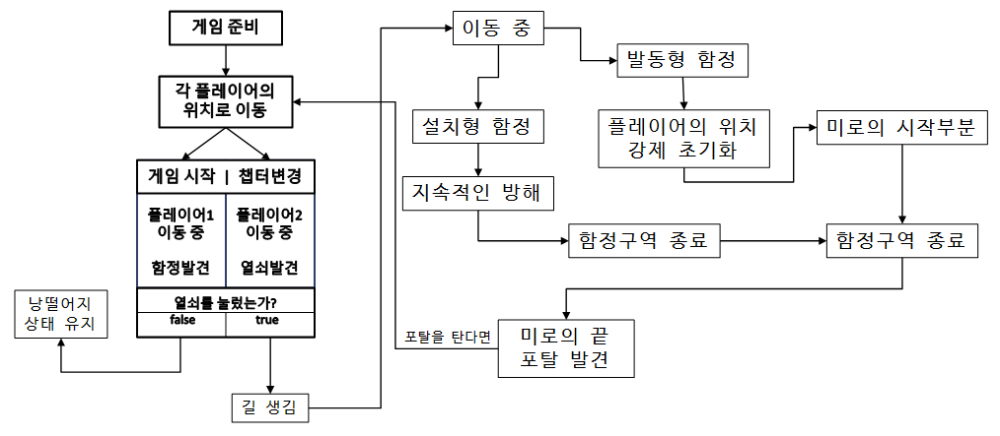

## 3. 키보드 이벤트에 대한 흐름도 

## 4. 용어정리 

# [스토리보드] 

## 스토리보드

# [개발작업 일정] 
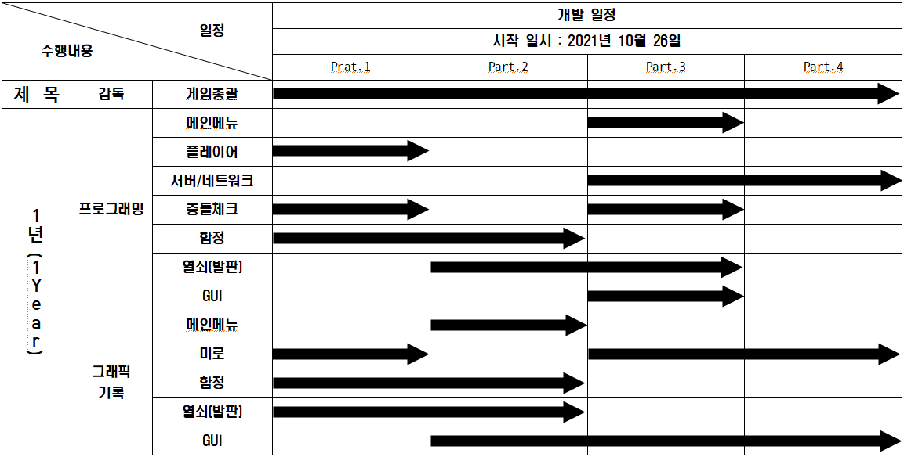

## [개발작업(Part.1)] 
### 작업명 : 플레이어, 미로, 함정의 기본틀 제작
### 해당 요구사항
- 미로는 정사각형 기준 20x20을 기준으로 잡고 제작을 한다.
- 미로와 플레이어는 충돌판정에 의해 통과할 수 없다.
- 조작은 기본적으로 W(전)S(좌)A(후)D(우)로 이동을 하며 마우스로 화면을 움직일 수 있다.
- WSAD의 속도는 모두 같다.
- 플레이어 인칭은 1인칭으로 화면에 비춘다.
- 스테이지마다 인칭의 변화는 없으며 미로의 종류변화만 있다.
- 낭떨어지의 개수는 스테이지당 10개 미만으로 설정
- 낭떨어지(함정)의 개수와 열쇠의 개수는 동일하게 한다.
- 함정(낭떨어지)의 열쇠 힌트는 바닥색상으로 준다.
- 게임화면에는 플레이어1과 플레이어2의 화면이 중간 세로줄을 기준으로 좌측은 플레이어1, 우측은 플레이어2의 화면이 나온다.
### 요구 사항에 따른 작업 내용
1. 

## [개발작업(Part.2)] 
### 작업명 : 함정과 열쇠의 상호작용 및 메인메뉴 디자인 구성
### 해당 요구사항
- 상호작용은 단 1번만 작용되며 한번 작용된 열쇠는 다시 작용하지 않는다.
- 함정 및 포탈은 플레이어 중심점을 기준으로 발동이 된다.
- 지속함정이 아닌 발동함정은 한 번 발동되면 사라진다.
- 남은 함정, 열쇠, 발판의 개수는 알려주지 않는다.
- 시작화면, 게임화면, 게임클리어화면, 설정화면, 설명화면 총 5개의 화면이 있다.
- 시작화면에는 시작, 설정, 게임설명, 게임종료 라는 버튼 4개가 있다.
- 설명화면에는 메인으로 버튼이 있고 클릭 시 시작화면으로 이동한다.
- 게임종료 조건은 따로 없으며 ESC를 누를 시 나가기 버튼이 화면 중간에 나오게 된다.
### 요구 사항에 따른 작업 내용
1. 

## [개발작업(Part.3)] 
### 작업명 : 서버 & 클라이언트 제작 및 메인메뉴 내부 작업진행
### 해당 요구사항
- 시작버튼 클릭 시 기존 4개의 버튼은 사라지고 플레이어1인지 플레이어2인지 선택 할 수 있는 버튼이 있다.
- 설명보기 버튼을 클릭 시 설명화면으로 이동한다.
- 게임시작버튼 클릭 이후 플레이어1 또는 플레이어2 클릭시 각자의 게임화면으로 넘어간다.
- 설정버튼 클릭 시 음량을 설정할 수 있다.
- 나가기 버튼을 누를 시 메인화면으로 빠져나가게 된다.
- 나가기 버튼으로 게임을 나오고 다시 시작버튼으로 게임 시작을 하게되면 처음부터 진행한다.
- 네트워크는 플레이어1이 서버 플레이어2를 클라이언트로 제작한다.
- 플레이어1이 서버이기 때문에 플레이어2만으로는 게임을 할 수 없다.
### 요구 사항에 따른 작업 내용
1. 

## [개발작업(Part.4)] 
### 작업명 : 서버 & 클라이언트 안정화 및 전체적인 그래픽 완성
- 마우스 클릭은 좌클릭만 존재하며 좌클릭 시 열쇠와 상호작용한다.
- 플레이어가 함정에 떨어져도 바로 전 자리로 이동할 수 있도록 한다.
- 클리어화면에는 클리어 메시지와 메인으로 하는 버튼이 존재하고, 메인으로 버튼 클릭 시 시작화면이 나온다.
- 네트워크는 플레이어1이 서버 플레이어2를 클라이언트로 제작한다.*
- 플레이어1이 서버이기 때문에 플레이어2만으로는 게임을 할 수 없다.**
### 요구 사항에 따른 작업 내용
1. 
