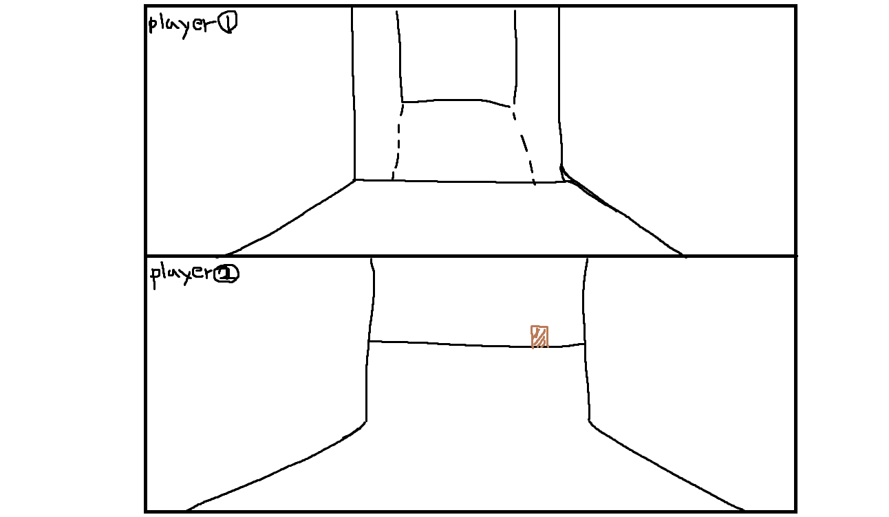
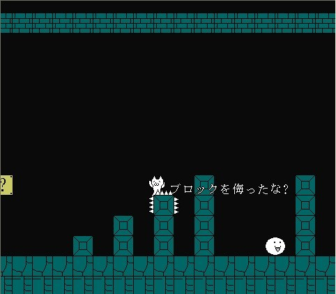
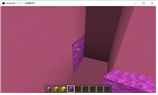
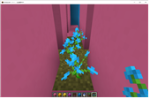
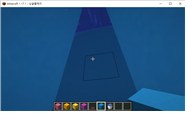
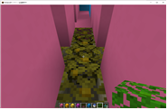
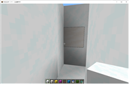
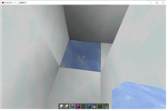

# 프로젝트명: 1년(1year)

# [ 목차 ]
### 1. [컨셉](#1)
### 2. [관련 이미지 & 동영상](#2)
### 3. [대표이미지](#3)
### 4. [컨셉 & 대표이미지 기반 작품묘사](#4)
### 5. [1년(1year)의 구성](#5)
### 6. [게임 시스템 디자인](#6)

# [컨셉] 

## 메인컨셉 : 협동

- 2인 플레이로 제작하여 서로간의 협동을 중심으로 게임을 진행

### 서브 컨셉 1 : 미로

- 협동을 하여 탈출하는 공간을 미로로 설정
- 넓은 맵을 이용하기 보다는 미로의 컨셉을 넣어 협동의 컨셉을 살리고자 함

### 서브 컨샙 2 : 시야

- 두 명의 플레이어에 각각 카메라를 달아 서로의 시야를 다르게 설정하지만 한 화면에 배치
- 각각 다른 화면을 한 화면에 배치함으로 영감을 받은 It Takes Two 와 같은 협동을 이끌어올 수 있다고 생각

### 서브 컨셉 3 : 함정

- 미로 곳곳에 탈출을 방해하는 함정을 설치함으로 탈출을 방해한다.
- 탈출을 늦추거나 미로의 시작지점으로 되돌아가게 설정
- 서브 컨셉 4와는 다르게 적용

### 서브 컨셉 4 : 히든

- 숨겨져 있거나 미로의 벽에 교묘하게 장착되있는 장치를 작동시켜야만 길이 열리는 컨셉으로 제작
- 장치는 단순한 발판으로 될 수있고 다른 장치가 될 수도 있다.

### 서브 컨셉 5 : 챕터

- 한 개의 미로가 아니라 여러개의 미로를 구현하여 어느정도의 시간이 걸리게 설정
- 제목의 의미를 담아 최소 4개의 챕터로 사계절을 나타낼 예정

  

# [관련 이미지 & 동영상] 

- 이미지  
  
- 동영상
  
  

  

# [대표 이미지] 

  

# [컨셉 & 대표이미지 기반 작품묘사] 

> ### 대표이미지 기반 :

> ### 컨셉 기반:

  

# [<1년(1Year)> 구성 요소] 

- 당신의 동료와 함께 힘을 모아 탈출 하는 3D미로 게임

 

## 1. 메커니즘

[도전 과제]

1. 미로 통과와 동시에 숨겨진 열쇠를 찾아 동료의 길을 열어라
2. 미로 곳곳에 있는 함정을 피해 자신과 동료의 리셋을 막아라
3. 여러개의 미로를 통과하여 동료와 함께 탈출하라

[재미 요소]

1. 숨겨진 열쇠를 찾으면 같은 팀의 길이 열린다.
2. 자기가 먼저 나아갈려해도 앞길은 낭떨어지 뿐이라 동료의 도움을 빌어야 될 수있다.
3. 일부로 길을 안열어 주는 트롤(고의적으로 게임을 방해하는 행동)도 가능
4. 열쇠는 2개가 동시에 있을 수 있다.
5. 마지막 챕터의 만남에서 또한 트릭이 숨어있다.

 

## 2. 이야기

[만들게 된 배경]  
  최근 유튜브에서 it takes two라는 게임을 재미있게 시청한 기억이 있다. 그래서 나도 이런 게임을 한번 만들어 보자라는 생각을 가지게 되었고 어떻게 하면 나만의 it takes two를 만들 수 있을까 고민하였고 예전부터 만들어 보고싶었던 미로라는 장르를 합쳐서 지금의 게임을 생각해보았다.

[카메라 관점]  
  카메라는 각 플레이어들의 1인칭 시점으로 제공되며 시점 버그로 미로를 미리 보게하는것을 방지하고자 한다. 그리고 각 플레이어들의 시점이 한 화면에 제공하여 자신의 화면을 보는 동시에 다른 플레이어의 화면을 볼 수있게 한다.
  
[스토리]
  어느 날 친구와 함께 담력 테스트를 하러 소문이 자자한 어느 한 건물에 들어가게 된다. 거기서 당신들이 마주한 것은 그저 평범한 물건들과 평범한 폐건물 내부였다. 하지만 소문에 비하면 평범하기 그지없었다. 그리고 당신은 친구와 함께 "별거 없잖아..."를 외치며 나가려고 했다. 하지만 그 동시에 건물 내부에는 엄청난 빛이 나와 시야를 가리게 되고 눈을 떠보니 눈앞에는 미로만이 존재하였다. 혼자 떨어진 줄 알았지만 친구의 목소리가 들려오게 되고 둘은 같지만 다른 미로에 떨어지게 된 것을 알게 되고 다른 방법이 없는 것을 알게 된 친구와 당신은 미로를 탈출하기로 하게 된다. 그러자 앞에 보이는 문구 하나 "가끔은 인생을 돌아보는 것도 중요하지. 그게 지금 바로 옆에 있는 사람이라는 더욱더 중요하겠지 그런 시간을 돌아 볼 수 있는 시간을 주겠다."라는 글만이 있었다. 그 이후 미로를 헤쳐나가면서 무언가를 느끼게 되는데...

 

## 3. 미적요소

[디자인]
- 미로는 3D로 제작예정이며 미로는 직접 플레이어 디자인은 평벙한 사람디자인이 아닌 카툰스타일로 디자인할 예정이다. 

[컬러]
- 컬러는 챕터별로 봄, 여름, 가을, 겨울에 맞는 색상으로 바뀌며 진행된다.
- 미로의 색상이 바뀜에따라 숨겨진 열쇠와 참정 또한 컨셉에 맞게 변경되는 점도 게임을 즐기는대 도움을 줄것을 예상

[음향]  
- 계절이 지남에 따라 봄은 들뜨는 느낌, 여름은 조금 신나는 느낌, 가을은 잔잔하고 겨움은 마지막에 두 플레이어가 만나는 곳이므로 조금 들뜨는 느낌으로 음향을 조절할 예정

 

## 4. 기술
- Unity3D를 사용하여 미로제작에 시간을 빠르게 투자할 예정이고 플렛폼은 아무래도 한화면에 두 플레이어의 활동을 담아야 되니 모니터에 작동시키는 것이 게임몰입감에 더 좋을 것이라도 생각하여 PC구동을 목표하고 있다. 

# [게임 시스템 디자인] 

## 1. 게임 오브젝트 분해 (구성 요소 분석)

|연번|오브젝트 이름|오브젝트 이미지|
|:----:|:----:|:----:|
|1|Player||
|2|maze||
|3|Trap||
|4|spTrap||
|5|smTrap||
|6|atTrap||
|7|wtTrap||

## 2. 파라미터(속성) 뽑아 보기

### 1) 오브젝트 이름 : 플레이어

|속성|영문명칭|설명|비고|
|:----:|:----:|:----:|:----:|
|이름|name|플레이어1, 2를 나누기 위한 각자의 이름|-|
|이동속도|speed|플레이어들의 이동속도. 속도는 앞 뒤 옆 이동 시 모두 동일하다.|-|

### 2) 오브젝트 이름 : 미로

|속성|영문명칭|설명|비고|
|:----:|:----:|:----:|:----:|
|봄 미로|spMaze|플레이어들이 처음 맞이하는 미로의 계절 속성|-|
|여름 미로|smMaze|플레이어들이 봄 미로를 클리어 했을 시 이동하는 미로|-|
|가을 미로|atMaze|플레이어들이 여름 미로를 클리어 했을 시 이동하는 미로|-|
|겨울 미로|wtMaze|플레이어들이 가을 미로를 클리어 했을 시 이동하는 미로|-|

### 3) 오브젝트 이름 : 함정

|속성|영문명칭|설명|비고|
|:----:|:----:|:----:|:----:|
|절벽 상태1, 2|maze_Cliff|기본적인 함정으로 기존길에 블록하나가 false상태로 되어있다. 그리고 버튼이나 블록클릭 시 true상태로 되어 보이게 된다.|false|
|발판 상태1, 2|maze_So|maze_Cliff를 true로 바꾸어주는 방법중 하나로 일반적인 블록위에 블록과 같은 정사각형 형태로 되어있다.|false|
|히든블록 상태1, 2|maze_bc|maze_Cliff를 true상태로 만들어 주는 것 중 하나로 일반적인 블록과 애매하게 색이 다르게 설정 되있어서 블록을 클릭하면 on/off 상태변환을 일으킨다.|false|

### 4) 오브젝트 이름 : 봄 미로 함정

|속성|영문명칭|설명|비고|
|:----:|:----:|:----:|:----:|
|꽃밭|spTrap_1|봄미로에는 꽃밭이라는 구역이 존재하며 꽃밭내에서는 플레이어속도가 –50%가 된다.|-|
|꽃가루|spTrap_2|플레이어가 꽃가루 지역이 들어가게 되면 5초 동안 스턴에걸려 움직이지 못하게 된다.|-|

### 5) 오브젝트 이름 : 여름 미로 함정

|속성|영문명칭|설명|비고|
|:----:|:----:|:----:|:----:|
|홍수|smTrap_1|플지정된 블록위로 플레이어가 들어가게 되면 근처 바닥의 블록이 모두 물로 바뀌게 된다. 이때 플레이어는 움직일 수있지만 물에 들어가면 자신의 위치가 초기화된다.|-|
|가뭄|smTrap_2|플레이어가 가뭄지역에 들어서게 되면 이동속도가 –80%가 된다.|-|

### 6) 오브젝트 이름 : 가을 미로 함정

|속성|영문명칭|설명|비고|
|:----:|:----:|:----:|:----:|
|한기|atTrap_1|가을미로는 기본적으로 추운기운이 있어서 지속적으로 이동속도가 20%느려진다.|-|
|젖은 나뭇잎|atTrap_2|젖은 나뭇잎은 미끄러워 화면이 정면으로 고정되고 W, S키만 눌리게 된다.|-|

### 7) 오브젝트 이름 : 겨울 미로 함정

|속성|영문명칭|설명|비고|
|:----:|:----:|:----:|:----:|
|폭설|wtTrap_1|미로 곳곳에 눈이 쌓여있다. 이 눈은 플레이어들이 치울 수 있다. 생김새는 평범한 눈블록과 비슷하다.|-|
|얇은 빙판|wtTrap_2|플레이어가 빙판블록을 밟게 되면 부서지며 플레이어는 초기위치로 이동하게 된다.|-|

## 3. 행동 뽑아 보기

### 1) 오브젝트 이름 : 플레이어

|행동|설명|
|:----:|:----:|
|대기|아무 행동도 하지 않는다.|
|순간이동|미로의 마무리인 포탈을 사용한다.|

### 2) 오브젝트 이름 : 미로

|행동|설명|
|:----:|:----:|
|길 생김|낭떨어지였던 곳에 다시 길이 생긴다.|
|길 사라짐|이 만들어졌던 곳이 다시 사라진다.|
|포탈 생성|미로의 마지막 포탈이 생성된다.|

### 3) 오브젝트 이름 : 함정

|행동|설명|
|:----:|:----:|
|함정 발동|플레이어가 특정 미로의 블록 이벤트로 생기는 함정에 걸렸을 때 발생.|
|함정 종료|플레이어가 특정 미로의 블록 이벤트로 생기는 함정에서 나왔을 때.|

## 4. 상태 뽑아 보기

### 1) 오브젝트 이름 : 플레이어

|현상태|전이상태|전이조건|
|:----:|:----:|:----:|
|정상|넝쿨(기본 이동속도-50%)|플레이어가 봄미로 일 때 꽃밭에 있는 동안 지속|
|정상|감기|플레이어가 꽃가루 지역에 들어간다.|
|정상|목마름|플레이어가 가뭄 지역에 들어가서 있는 동안 지속|
|정상|몸살|플레이어가 가을 미로에 있을 경우 지속적으로 받는다.|
|현재 미로|다음 미로|플레이어가 포탈로 들어간다.|

### 2) 오브젝트 이름 : 함정

|현상태|전이상태|전이조건|
|:----:|:----:|:----:|
|낭떨어지 블록/false|낭떨어지 블록/true|플레이어가 열쇠로 해결 했을 시|
|함정 발동|함정 종료|함정의 지속시간이 다 되었을 시|
|함정 종료|함정 재생성|플레이어가 함정에 의해 초기화를 당했을 시|

## 5. 플레이어 캐릭터 속성(파라미터)

|속성|영문명칭|설명|비고|
|:----:|:----:|:----:|:----:|
|이동속도|speed|플레이어의 이동속도를 나타낸다.|-|
|위치정보|Tranform|플레이어의 위치정보|-|
|true|isTrap|플레이어가 위치 초기화 함정에 걸렸는지 확인하는 속성|-|

## 6. 게임의 규칙

### 1) 핵심 규칙
1. 함정을 피하거나 견뎌 미로를 탈출하라
2. 같이 플레이하는 사람의 함정은 자신이 해결할 수 있다.
3. 진행을 동시에 하는 것이 미로 해결에 핵심

### 2) 보조 규칙
1. 함정은 언제나 같은 자리에 존재한다.
2. 위치 초기화 함정이 있는 곳은 언제나 의심해야 한다.
3. 막다른 길을 싫어하지 말아야 할 것
